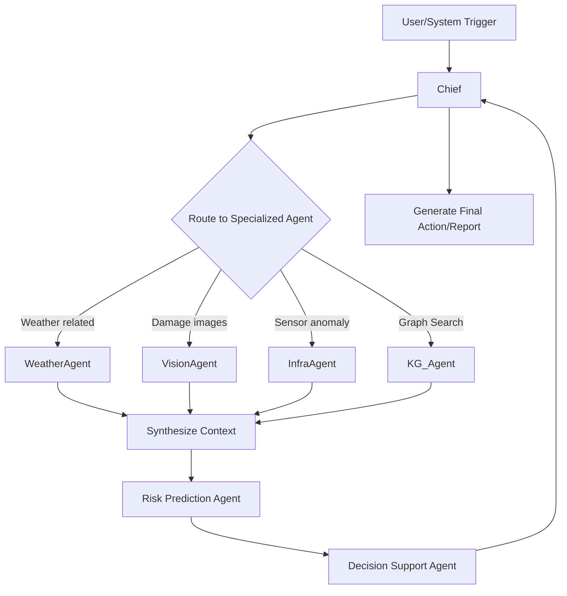
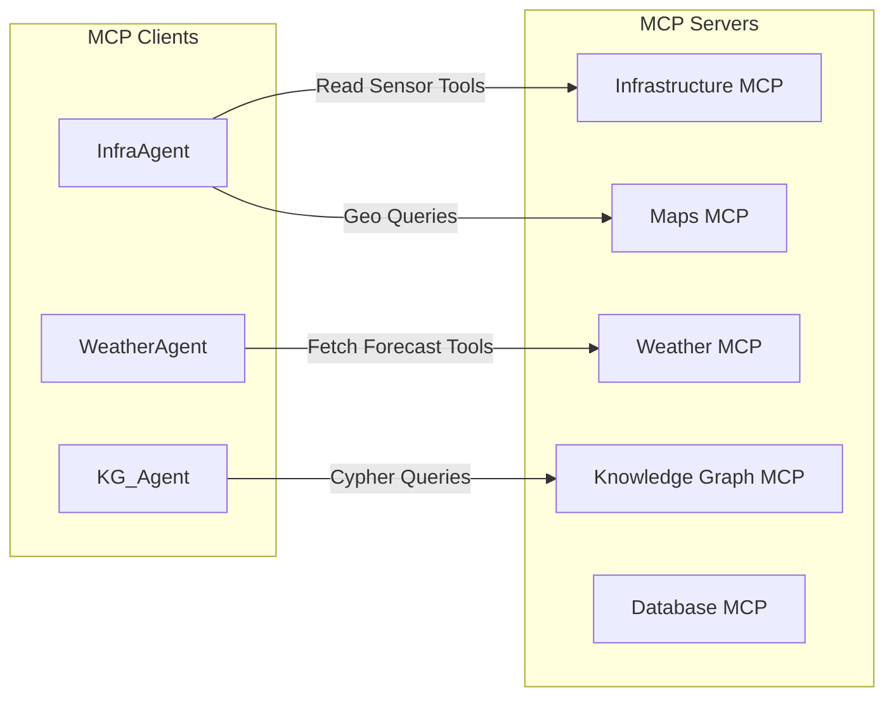
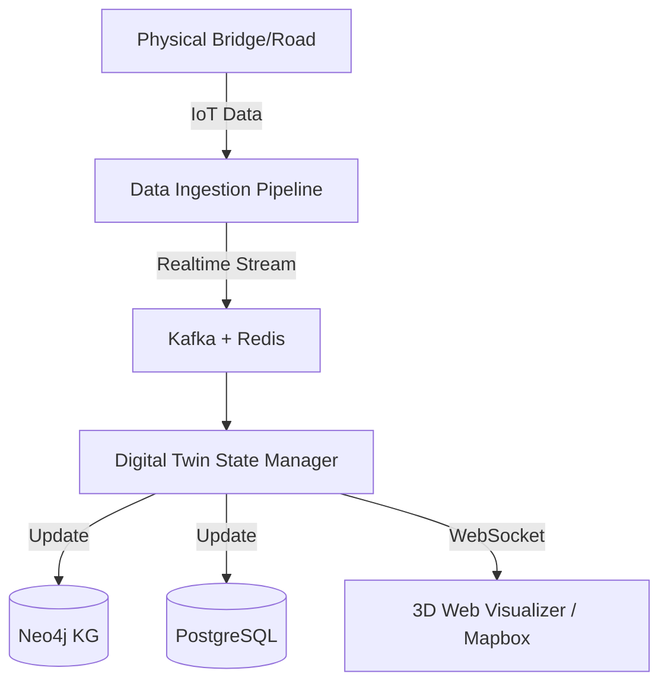
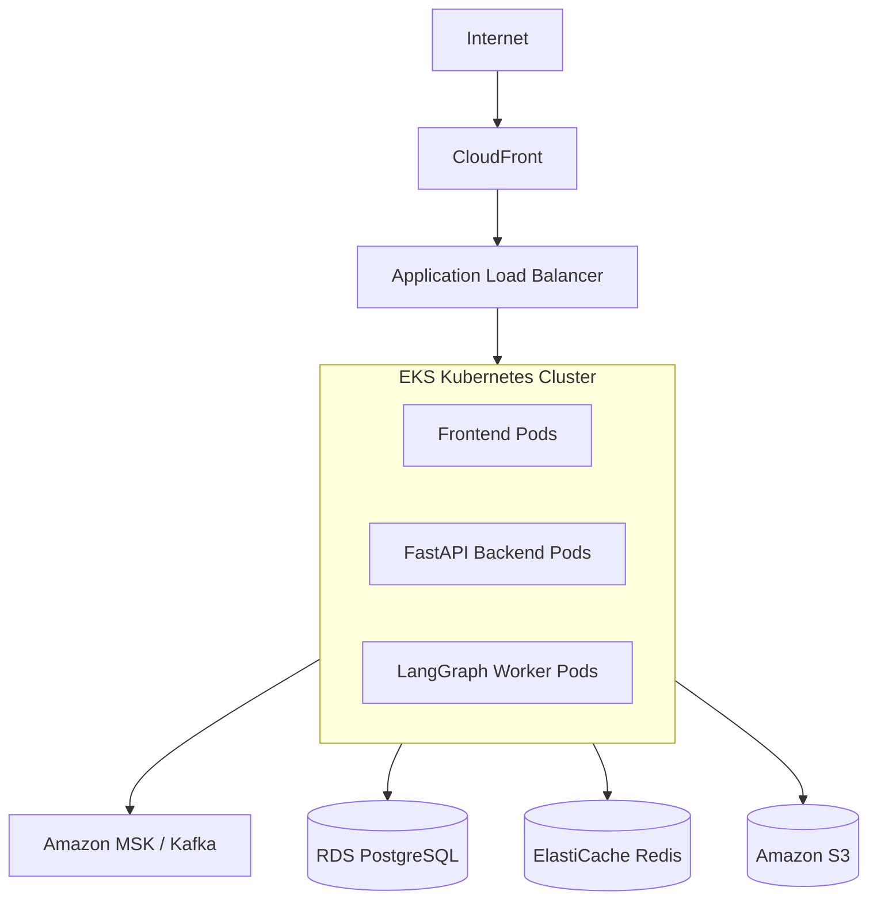

# High-Level Design (HLD) & Architecture
## Project AstraMind

### 1. System Architecture Overview
AstraMind follows a modular, microservices-based, event-driven architecture designed for high availability and scalability.

```mermaid
graph TD
    %% User Interfaces
    subgraph Frontend
        WebUI[Next.js Web App]
        MobileApp[Mobile Dashboard]
    end

    %% API Gateway
    APIGW[API Gateway / Load Balancer]

    %% Backend Services
    subgraph Backend Services
        AuthSvc[Auth Service]
        IngestionSvc[Data Ingestion Service]
        DigitalTwinSvc[Digital Twin Service]
        AlertSvc[Notification Service]
    end

    %% AI Agent Orchestration
    subgraph LangGraph Multi-Agent System
        Chief[Chief AI Coordinator]
        InfraAgent[Infrastructure Agent]
        WeatherAgent[Weather Agent]
        VisionAgent[Vision AI Agent]
        RiskAgent[Risk Prediction Agent]
        NewsAgent[News Intelligence Agent]
        DecisionAgent[Decision Support Agent]
        KG_Agent[Knowledge Graph Agent]
        Chief --> InfraAgent & WeatherAgent & VisionAgent & RiskAgent & NewsAgent & DecisionAgent & KG_Agent
    end

    %% Message Broker
    Kafka[Apache Kafka / RabbitMQ]

    %% Databases
    subgraph Data Layer
        PostgreSQL[(PostgreSQL - Relational)]
        Redis[(Redis - Cache/Celery)]
        Neo4j[(Neo4j - Knowledge Graph)]
        Qdrant[(Qdrant - Vector DB)]
        MinIO[(MinIO/S3 - Object Storage)]
    end

    %% External Systems
    subgraph External Inputs
        Sensors[IoT Sensors]
        WeatherAPI[IMD / NASA]
        Satellite[Satellite Imagery]
        NewsAPI[News / Gov PDFs]
    end

    %% Connections
    Frontend --> APIGW
    APIGW --> AuthSvc & DigitalTwinSvc & AlertSvc
    Sensors & WeatherAPI & Satellite & NewsAPI --> IngestionSvc
    IngestionSvc --> Kafka
    Kafka --> Backend Services
    Backend Services --> Data Layer
    DigitalTwinSvc <--> Chief
    Chief <--> Data Layer
```

### 2. Agent Flow Architecture
The Multi-Agent system operates using LangGraph, maintaining state and enabling collaborative reasoning.



### 3. MCP Architecture
Model Context Protocol (MCP) Servers expose specific tools and data context to the agents safely.



### 4. Digital Twin Architecture
Maintains the live, synchronised state of physical assets.



### 5. Deployment Architecture (AWS EKS)

*(Note: standard flowchart preferred for detail)*

