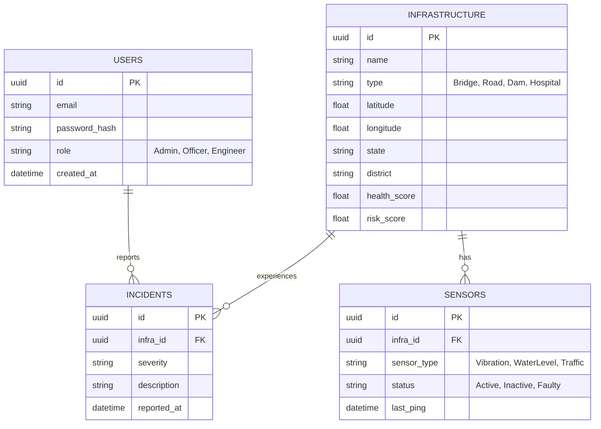
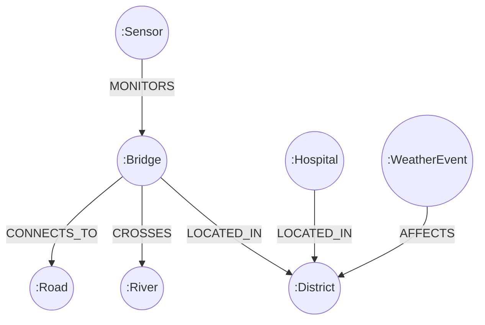
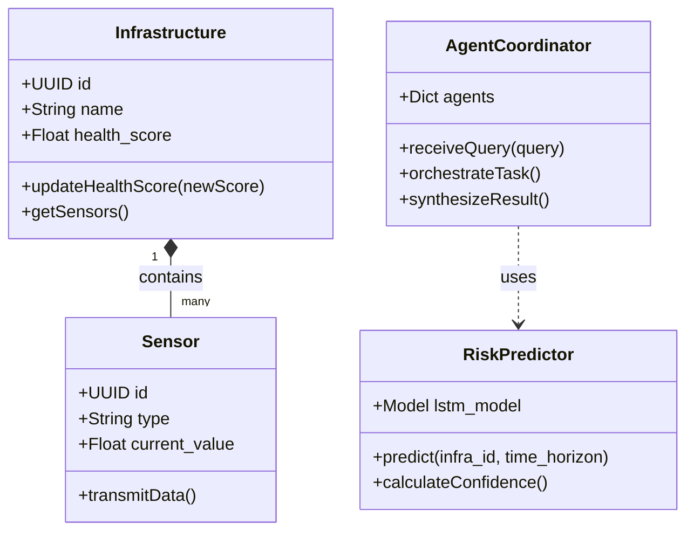
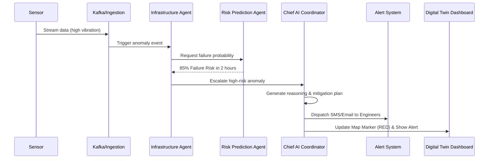

# Low-Level Design (LLD)
## Project AstraMind

### 1. Database Design (PostgreSQL ER Diagram)
Stores structured relational data for users, infrastructure metadata, and historical records.



### 2. Knowledge Graph Design (Neo4j)
Captures the complex, multi-dimensional relationships of the digital twin.



### 3. Class Diagram (Core Backend Services)


### 4. Sequence Diagram: Anomaly Detection to Alert


### 5. Use Case Diagram
```mermaid
usecaseDiagram
    actor "Govt Officer" as Govt
    actor "Engineer" as Eng
    actor "System Sensor" as Sys

    usecase "View National Dashboard" as UC1
    usecase "Run What-If Simulation" as UC2
    usecase "Inspect Bridge Health" as UC3
    usecase "Receive Maintenance Alert" as UC4
    usecase "Stream Telemetry Data" as UC5

    Govt --> UC1
    Govt --> UC2
    Eng --> UC3
    Eng --> UC4
    Sys --> UC5
```
